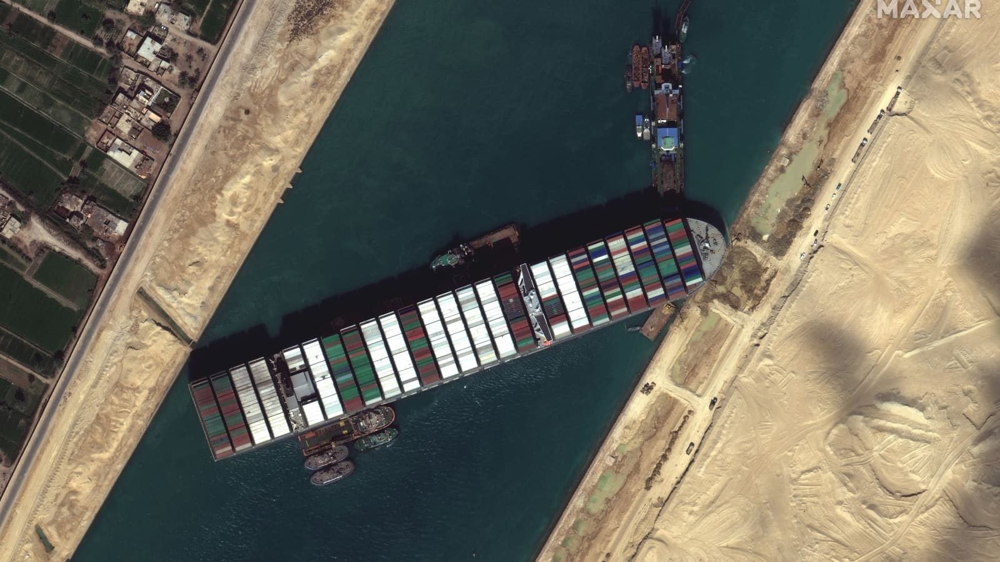

# Suez Canal Crisis
 
The **Suez Canal Crisis** occurred recently, when a ship from the Evergreen company got stuck in the canal, blocking all passage. 
This boat, named the *Ever Given*, got stuck after drawing a serxually explicit outline while waiting to enter the canal. 
Since the issue occured, the boat was stuck for 6 days, and caused 9.6 billion USD in damages.

>On the subject, one source says, "The vessel was finally freed six days later. Egyptian authorities said that there may have been technical or human errors also involved.".

- This prevented dozens of ships from continuing their shipping patterns, causing [millions in delay damages](https://interestingengineering.com/evergreen-asked-1-billion-to-leave-suez-canal).
- Also, the ship is being fined [1 billion USD](https://www.caranddriver.com/news/a36083944/suez-canal-evergreen-ship-fined/) for the trouble they caused by being stuck.
- The cause was [strong winds](https://en.wikipedia.org/wiki/2021_Suez_Canal_obstruction), which led to the ship being unable to steer properly, and created the predicament for the other ships in the canal as well.